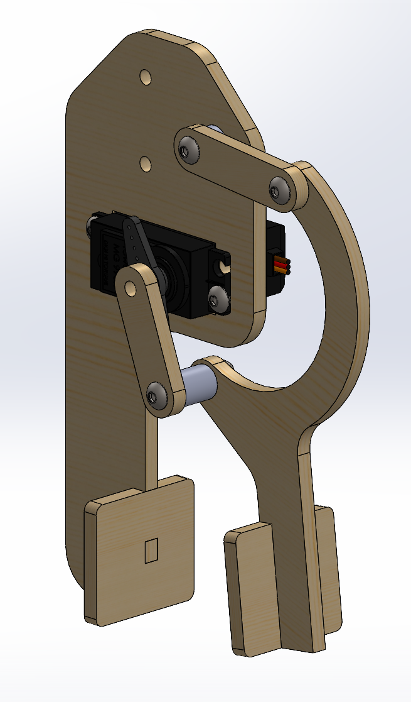
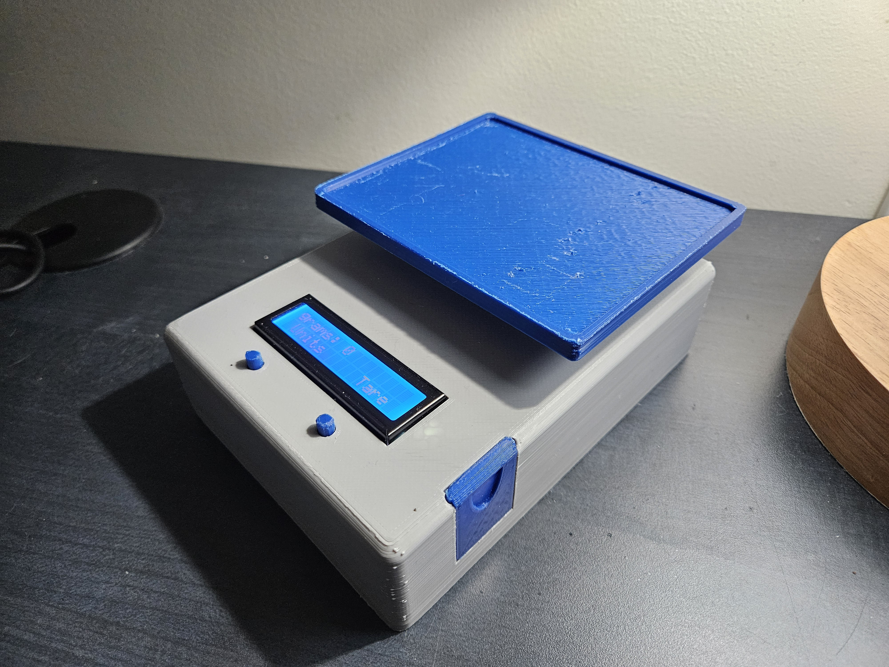
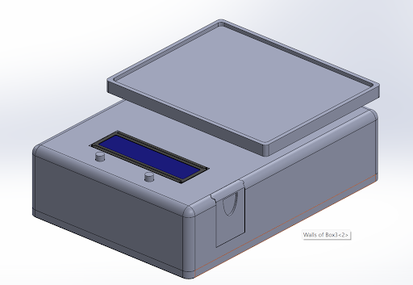
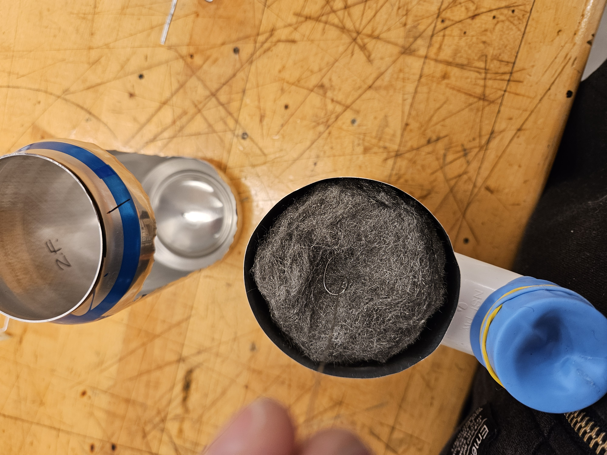
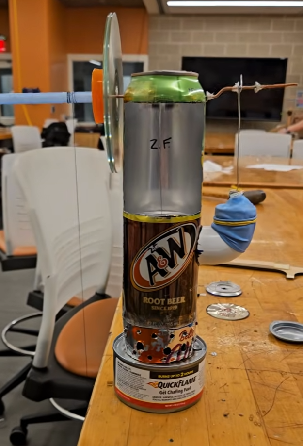
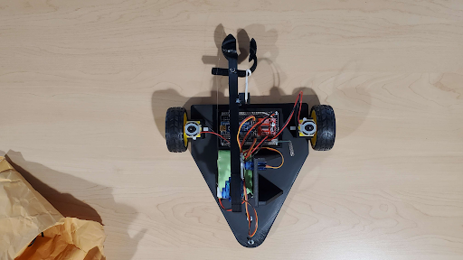

# Hi! Welcome to Zachary Freese's Mechanical Engineering Portfolio

These are meaningful projects that I made while attending Rowan University.

---

## Mechanical Arm (Fall 2023)

| Video Link | Claw Design |
| ---- | ----- |
| [](https://www.youtube.com/watch?v=ai-nQ_gWu8w) | <br> |


**Summary:** This objective of this project was to successfully pick up a payload (cube), and place it into a specifiec drop zone. I worked with three other students to analyze, design and build a working model to complete our task. In this project, my role was to design and build a working claw model in solidworks using a graphical linkage system. From there, I laser cut all of the components and assembled them using nuts and bolts available in the the ME shop. I also helped program the robotic arm using arduino IDE.

**Challenges:** This was one of my first times using solidsworks, so learning how to use the software to meet deadlines was difficult. Assembling the arm for the first time was problematic and it did not go as planned. Luckly, I was prepared for mistakes and errors and I was able to fix them before moving to the next stage of the project.

**Arduino Code:** 

<details>

```  
//Mechanized Arm State Machine
//Autonomous Robot for Phase 4 - Complete Mechanized Arm
//Written By: Karl Dyer 2016


#include <Servo.h>


// Angle Variables
// These angle must be update for each specific robot
const int A_ClawOpen = 180;     // Angle where claw is open
const int A_ClawClosed = 92;  // Angle where claw is closed
const int A_ArmUp = 180;       // Angle where arm is up
const int A_ArmDown = 50;      // Angle where arm is down
const int A_BaseUp = 4;        // Angle where base picks up payload
const int A_BaseDown = 177;    // Angle where base puts down payload
const int A_BaseWait = 85;    // Angle where base puts down payload


// Delay Variables
// The numbers below are how many milliseconds to wait between each degree of servo movement
// the larger the number the slower the servo will apparently move, recommended range is 1 - 50
const int D_Claw = 1;          // [ms] delay/degree of change on servo
const int D_Arm = 30;          // [ms] delay/degree of change on servo
const int D_Base = 30;         // [ms] delay/degree of change on servo


// The distance threshold must be updated for each specific robot
const float D_Threshold = 11;  // [cm] Object present threshold distance
float D_Distance = 10000;      // [cm] initialize distance reading from sensor to be large


// Servo Connections
Servo S_Claw;         // create servo object for claw
Servo S_Arm;          // create servo object for arm
Servo S_Base;         // create servo object for base


// Potentiometer Connections
int P_Claw = 9;       // Claw Pin
int P_Arm = 10;       // Arm Pin
int P_Base = 11;      // Base Pin


// Sonar Connections
int P_Trigger = 6;    // Trigger Pin
int P_Echo = 5;       // Echo Pin


// LED Connections
int P_Red = 7;        // Red LED pin
int P_Yellow = 4;     // Yellow LED pin
int P_Green = 2;      // Green LED pin


// Time Variables
int T_Start = 0;             // [ms] stores the time at which the timer was started
int T_Elapsed = 0;           // [ms] time elapsed since "Time" variable was last captured
int T_Threshold = 5000;      // [ms] time needed to ensure part is there


// State Variable
//   1 - DETECT: Determining if object is present and time duration
//   2 - MOVE: Robot completes lift cycle
//   3 - REMOVAL: Arm waiting for object to be removed
int state = 1;              //intialize to DETECT STATE


void setup() {
  //Attach Servos
  S_Claw.attach(P_Claw);       // Attach claw servo to digital pin
  S_Arm.attach(P_Arm);         // Attach arm servo to digital pin
  S_Base.attach(P_Base);       // Attach arm servo to digital pin


  //Set Pin Directions
  pinMode(P_Trigger, OUTPUT);  //Set trigger pin as an output
  pinMode(P_Echo, INPUT);      //Set echo pin as an input
  pinMode(P_Red, OUTPUT);      //Set LED as output
  pinMode(P_Yellow, OUTPUT);   //Set LED as output
  pinMode(P_Green, OUTPUT);    //Set LED as output


  Serial.begin(9600);          //Start serial communications
 
  // POST - Power On Self Test
  // Turn all LEDs on for 1s then turn off in sequence leaving red on
  digitalWrite(P_Red, HIGH);
  digitalWrite(P_Yellow, HIGH);
  digitalWrite(P_Green, HIGH);
  delay(1000);
  digitalWrite(P_Green, LOW);
  delay(1000);
  digitalWrite(P_Yellow, LOW);
  delay(1000);
  digitalWrite(P_Red, LOW);


  //Initialize - Set robot in the ready position
  //Enable red LED to warn of movement
  digitalWrite(P_Red, HIGH);
  digitalWrite(P_Yellow, LOW);
  digitalWrite(P_Green, LOW);
  delay(1500);


  // Set Robot - slowServo(Servo, Start Angle, End Angle, Delay)
  slowServo(S_Claw, A_ClawClosed, A_ClawOpen, D_Claw);     // open claw
  delay (200);
  slowServo(S_Arm, A_ArmDown, A_ArmUp, D_Arm);             // raise arm
  delay(200);
  slowServo(S_Base, A_BaseDown, A_BaseWait, D_Base);         // rotate base
  delay(200);


  //Enable green LED to indicate ready
  digitalWrite(P_Red, LOW);
  digitalWrite(P_Yellow, LOW);
  digitalWrite(P_Green, HIGH);
}


void loop() {
  switch (state) {    
    case 1: //Detect - Determine if object is present and time duration
      D_Distance = GetDistance(P_Trigger,P_Echo);     //Get distance measurement
      if (D_Distance > D_Threshold) {//NO OBJECT
        //Set LEDs
          digitalWrite(P_Red, LOW);
          digitalWrite(P_Yellow, LOW);
          digitalWrite(P_Green, HIGH);
       
        T_Start = millis();                           //Update time to current time
        Serial.println("[cm] - Waiting for Object");
      } else { //OBJECT
        //Set LEDs
        digitalWrite(P_Red, LOW);
        digitalWrite(P_Yellow, HIGH);
        digitalWrite(P_Green, LOW);


        T_Elapsed = millis()-T_Start;                 //Calculate elapsed time
        Serial.print("[cm] - Object Detected for ");
        Serial.print(float(T_Elapsed)/1000.0);
        Serial.println("[s]");
        }


      if (T_Elapsed > T_Threshold) {// timer exceeds threshold
        state = 2; //Change to MOVE state
      }
      break;
   
    case 2: //Move - Robot completes a lift cycle
      //Set LEDs
      digitalWrite(P_Red, HIGH);
      digitalWrite(P_Yellow, LOW);
      digitalWrite(P_Green, LOW);


      Serial.println("Lifting Sequence Starting");
      Serial.println("Rotating to Pickup");
      slowServo(S_Base, A_BaseWait, A_BaseUp, D_Base);
      delay(3000);


      Serial.println("Arm Lowering");
      slowServo(S_Arm, A_ArmUp, A_ArmDown, D_Arm);
      delay(2000);
     
      Serial.println("Claw Closing");
      slowServo(S_Claw, A_ClawOpen, A_ClawClosed, D_Claw);
      delay(1500);
     
      Serial.println("Arm Raising and Dwell");
      slowServo(S_Arm, A_ArmDown, A_ArmUp, D_Arm);
      delay(3000);


      Serial.println("Rotating to Dropoff");
      slowServo(S_Base, A_BaseUp, A_BaseDown, D_Base);
      delay(3000);
     
      Serial.println("Arm Lowering");
      slowServo(S_Arm, A_ArmUp, A_ArmDown, D_Arm);
      delay(2000);
     
      Serial.println("Claw Opening");
      slowServo(S_Claw, A_ClawClosed, A_ClawOpen, D_Claw);
      delay(1500);
     
      Serial.println("Arm Raising");
      slowServo(S_Arm, A_ArmDown, A_ArmUp, D_Arm);
      delay(2000);


      Serial.println("Rotating to Wait Location");
      slowServo(S_Base, A_BaseDown, A_BaseWait, D_Base);
      delay(3000);
     
      state = 3; //change to REMOVAL state
      break;
   
    case 3: //Removal - Robot waits for object to be removed
      //Set LEDs
      digitalWrite(P_Red, LOW);
      digitalWrite(P_Yellow, LOW);
      digitalWrite(P_Green, HIGH);


      D_Distance = GetDistance(P_Trigger,P_Echo);
      if (D_Distance < D_Threshold + 3){ //+3[cm] compensates for a cube that is jostled on setdown
        Serial.println("[cm] - Remove Object");
      } else {
        state = 1;      //change to READY state
        T_Elapsed = 0;  //reset timer
        T_Start = 0;    //reset start time
      }
      break;
    }
}


void slowServo (Servo &theServo, int st, int en, int d){
  // call is Servo, Start Angle, End Angle, Delay
  for (int i=1; i<=abs(st-en); i++){ // increment through each angle from start to end point one degree at a time
    st<en ? theServo.write(st+i) : theServo.write(st-i); // select adding or subtracting depending on direction servo must move
    delay(d);    // delay
  }
}


float GetDistance (int trigger, int echo){
  // Get distance from the Sonar Senor   ________________
  // Generate Trigger Pulse Wave  LOW  _|  10us min HIGH |___ LOW
  digitalWrite(trigger, LOW);    // Send out a low pulse
  delayMicroseconds(2);             // Wait
  digitalWrite(trigger, HIGH);   // Send out a high pulse
  delayMicroseconds(10);            // Wait
  digitalWrite(trigger, LOW);    // Send out a low pulse
 
  // Listen for a reply on the echo pin
  //Calculate distance by dividing pulse width by 58 for [cm] or 148 for [in]
  float distance = pulseIn(echo, HIGH)/58.0; //[cm] Distance of object in front of sonar sensor
  delay(60);                                 // Delay program to hit recommended measurement cycle
  Serial.print(distance);                    // Print distance out to serial port for user to see
   
  return distance;
}
```

</details>

---

## Digital Scale (Fall 2023)

| Real model | Rendered Model |
| --- | --- | 
| <br> | <br> |

**Summary:** I had to design and build a working digital scale that has the ability to tare, and change units and also stay within a certain build volume. The load cell used in this project was provided through the university, however, I had to machine two other componenets on the lathe and mill to a specified tolerance which the load cell sat on. The scale had to encapsulate 6 volts worth of batteries, the load cell, a programmed circuit board, LED display, buttons and a tray. 

**Challenges:** Some challenges faced in this project were 3D printing the final model and coding a debounce loop into ardunio in order to have responsive bottons. I went through 3 interations before I was satisfied with the final model.


---

## Soda Can Stirling Engine (Spring 2024)

| Video Links | Pictures |
| ---- | ----- |
| [](https://www.youtube.com/shorts/3Y_sKm8OTxA) | <br> |
| [![YouTube Shorts Preview]<br>](https://youtube.com/shorts/afP9vJ6MEqE) | |

---

## RC Car

| Video Link | RC Car |
| ---- | ----- |
| [](https://www.youtube.com/watch?v=rvY-m6PBqEQ) | <br> |

---

## Acrhimedes Wind Turbine (Fall 2025)

---

## Fluid Dynamic Demonstrations for Classrooms (Spring 2026)
